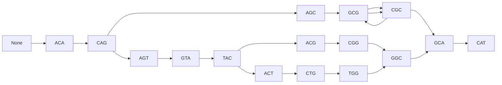

```mermaid
graph LR;
None --> ACA;
ACA --> CAG;
CAG --> AGT;
CAG --> AGC;
AGT --> GTA;
AGC --> GCG;
GTA --> TAC;
GCG --> CGC;
GCG --> CGC;
TAC --> ACG;
TAC --> ACT;
CGC --> GCG;
CGC --> GCA;
ACG --> CGG;
ACT --> CTG;
GCA --> CAT;
CGG --> GGC;
CTG --> TGG;
GGC --> GCA;
TGG --> GGC;
```