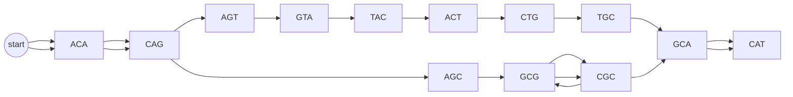
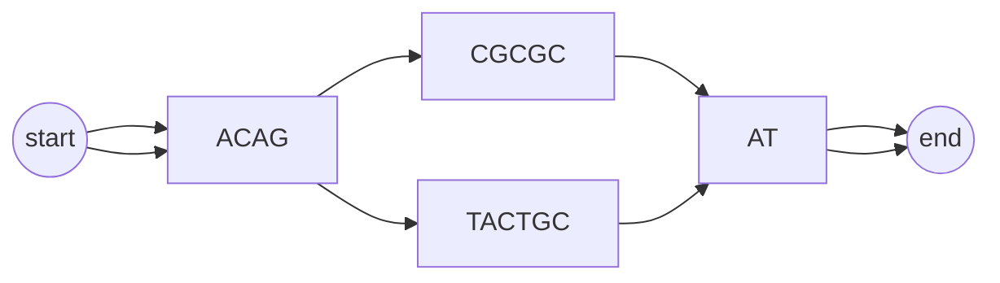

```mermaid
graph LR;
s((start)) --> ACA--> CAG;
s((start)) --> ACA--> CAG;
CAG --> AGT-->GTA-->TAC-->ACT-->CTG-->TGC-->GCA-->CAT;
CAG --> AGC;
AGC --> GCG;
GCG --> CGC;
GCG --> CGC;
CGC --> GCG;
CGC --> GCA;
GCA --> CAT;
```

```mermaid
graph LR;
s((start))-->ACAG
ACAG --> CGCGC --> AT;
AT-->e((end))
s-->ACAG --> TACTGC-->AT;
AT-->e;
```