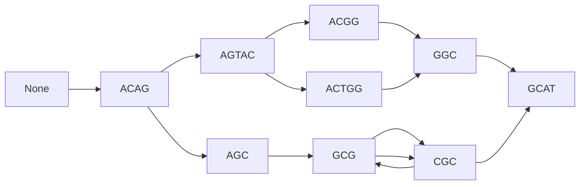

```mermaid
graph LR;
None --> ACAG;
ACAG --> AGTAC;
ACAG --> AGC;
AGTAC --> ACGG;
AGTAC --> ACTGG;
AGC --> GCG;
ACGG --> GGC;
ACTGG --> GGC;
GCG --> CGC;
GCG --> CGC;
GGC --> GCAT;
CGC --> GCG;
CGC --> GCAT;
```