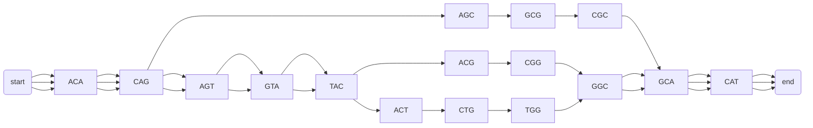

```mermaid
graph LR;
 s(start);
 e(end);
 s --> ACA;
s --> ACA;
s --> ACA;
ACA --> CAG;
ACA --> CAG;
ACA --> CAG;
CAG --> AGT;
CAG --> AGT;
CAG --> AGC;
AGT --> GTA;
AGT --> GTA;
AGC --> GCG;
GTA --> TAC;
GTA --> TAC;
GCG --> CGC;
TAC --> ACG;
TAC --> ACT;
CGC --> GCA;
ACG --> CGG;
ACT --> CTG;
GCA --> CAT;
GCA --> CAT;
GCA --> CAT;
CGG --> GGC;
CTG --> TGG;
GGC --> GCA;
GGC --> GCA;
TGG --> GGC;
CAT --> e;
CAT --> e;
CAT --> e;
```