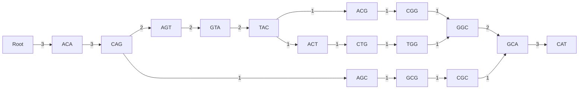

```mermaid
graph LR;
Root -->|"3"| ACA;
ACA -->|"3"| CAG;
CAG -->|"2"| AGT;
AGT -->|"2"| GTA;
GTA -->|"2"| TAC;
TAC -->|"1"| ACG;
ACG -->|"1"| CGG;
CGG -->|"1"| GGC;
GGC -->|"2"| GCA;
GCA -->|"3"| CAT;
TAC -->|"1"| ACT;
ACT -->|"1"| CTG;
CTG -->|"1"| TGG;
TGG -->|"1"| GGC;
CAG -->|"1"| AGC;
AGC -->|"1"| GCG;
GCG -->|"1"| CGC;
CGC -->|"1"| GCA;
```