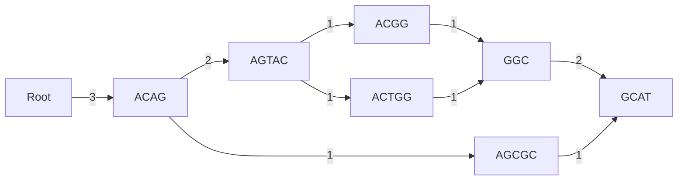

```mermaid
graph LR;
Root -->|"3"| ACAG;
ACAG -->|"2"| AGTAC;
AGTAC -->|"1"| ACGG;
ACGG -->|"1"| GGC;
GGC -->|"2"| GCAT;
AGTAC -->|"1"| ACTGG;
ACTGG -->|"1"| GGC;
ACAG -->|"1"| AGCGC;
AGCGC -->|"1"| GCAT;
```