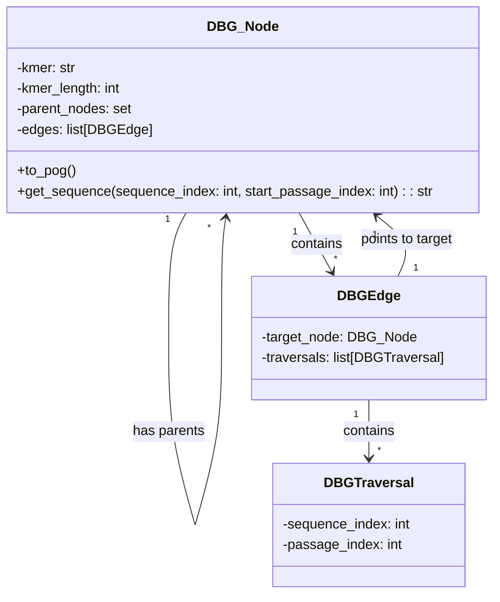

```mermaid
classDiagram
    class DBG_Node {
        -kmer: str
        -kmer_length: int
        -parent_nodes: set
        -edges: list[DBGEdge]
        +to_pog()
        +get_sequence(sequence_index: int, start_passage_index: int): str
    }
    class DBGEdge {
        -target_node: DBG_Node
        -traversals: list[DBGTraversal]
    }
    class DBGTraversal {
        -sequence_index: int
        -passage_index: int
    }
    DBG_Node "1" --> "*" DBG_Node : has parents
    DBG_Node "1" --> "*" DBGEdge : contains
    DBGEdge "1" --> "1" DBG_Node : points to target
    DBGEdge "1" --> "*" DBGTraversal : contains

```
