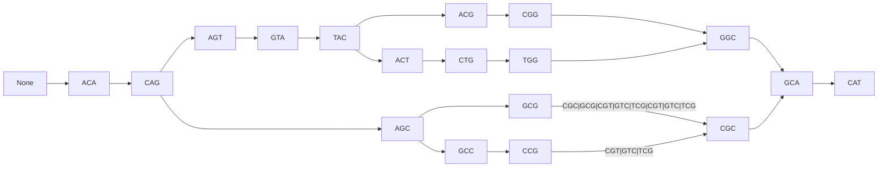
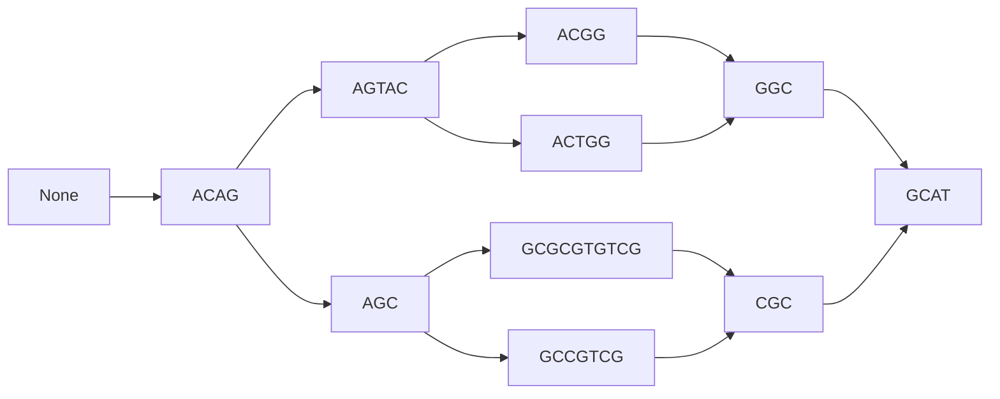
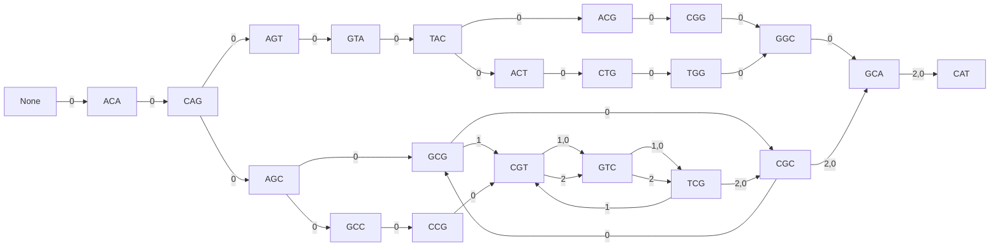
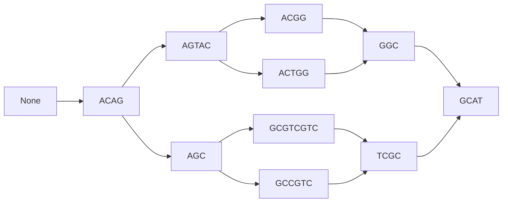

### Consider 4 sequences

- ACAGTACGGCAT
- ACAGTACTGGCAT
- ACAGCGCGCGTCGTCGCAT
- ACAGCCGTCGCAT

## Xingjians method

```mermaid
graph LR;
None --> ACA;
ACA --> CAG;
CAG --> AGT;
CAG --> AGC;
AGT --> GTA;
AGC --> GCG;
GTA --> TAC;
TAC --> ACG;
TAC --> ACT;
ACG --> CGG;
ACT --> CTG;
GCA --> CAT;
CGG --> GGC;
CTG --> TGG;
GGC --> GCA;
TGG --> GGC;
GCG --CGC|GCG|CGT|GTC|TCG|CGT|GTC|TCG-->CGC--> GCA;
AGC-->GCC-->CCG--CGT|GTC|TCG-->CGC;
```

### Fragments

```mermaid
graph LR;
None --> ACAG;
ACAG --> AGTAC-->ACGG-->GGC-->GCAT;
AGTAC-->ACTGG-->GGC;
ACAG-->AGC-->GCGCGTGTCG-->CGC-->GCAT
AGC-->GCCGTCG-->CGC


```

## Richard's method

```mermaid
graph LR;
None --0--> ACA;
ACA --0--> CAG;
CAG --0--> AGT;
CAG --0--> AGC;
AGT --0--> GTA;
AGC --0--> GCG;
GTA --0--> TAC;
TAC --0--> ACG;
TAC --0--> ACT;
ACG --0--> CGG;
ACT --0--> CTG;
GCA --2,0--> CAT;
CGG --0--> GGC;
CTG --0--> TGG;
GGC --0--> GCA;
TGG --0--> GGC;
GCG --0--> CGC;
CGC --0--> GCG;
GCG --1--> CGT;
CGT --1,0--> GTC;
GTC --1,0--> TCG;
TCG --1--> CGT;
CGT --2--> GTC;
GTC --2--> TCG;
TCG --2,0--> CGC;
CGC --2,0--> GCA;
AGC--0-->GCC--0-->CCG--0-->CGT;


```
### Fragments

```mermaid
graph LR;
None-->ACAG
ACAG-->AGTAC
AGTAC-->ACGG-->GGC
GGC-->GCAT
AGTAC-->ACTGG-->GGC

ACAG-->AGC-->GCGTCGTC-->TCGC-->GCAT
AGC-->GCCGTC-->TCGC
```